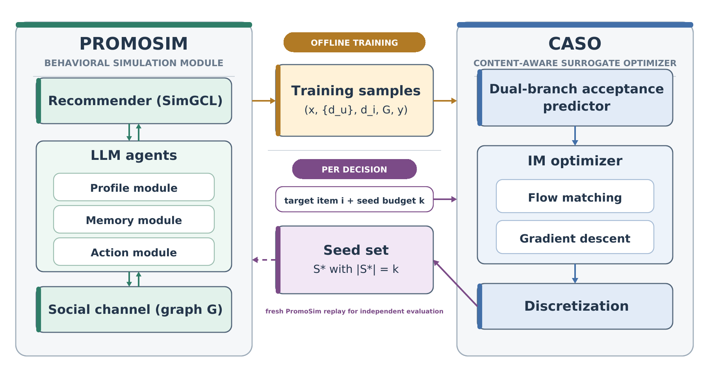
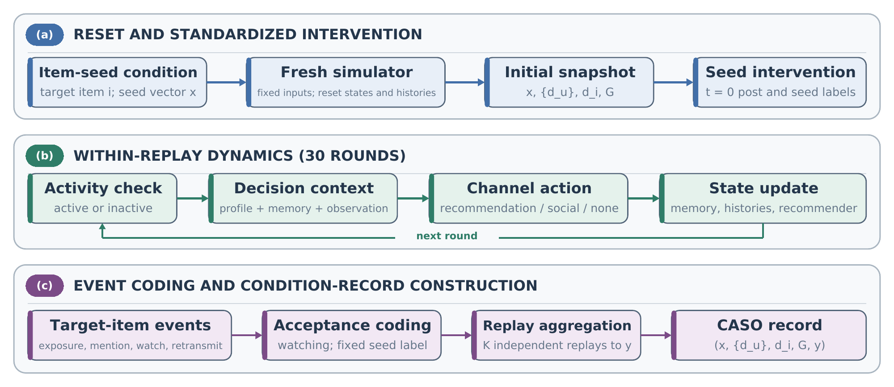
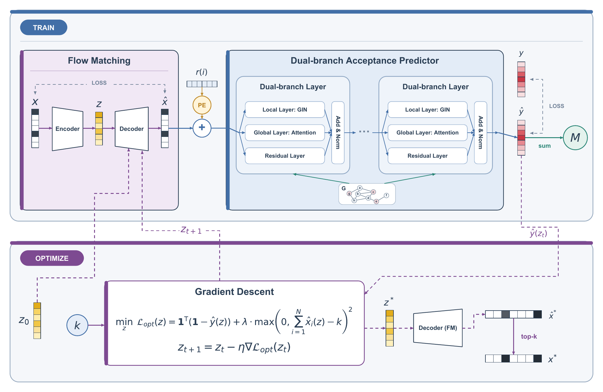
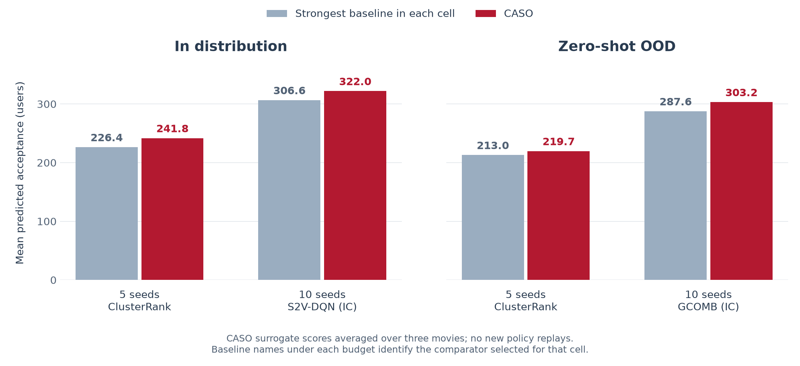
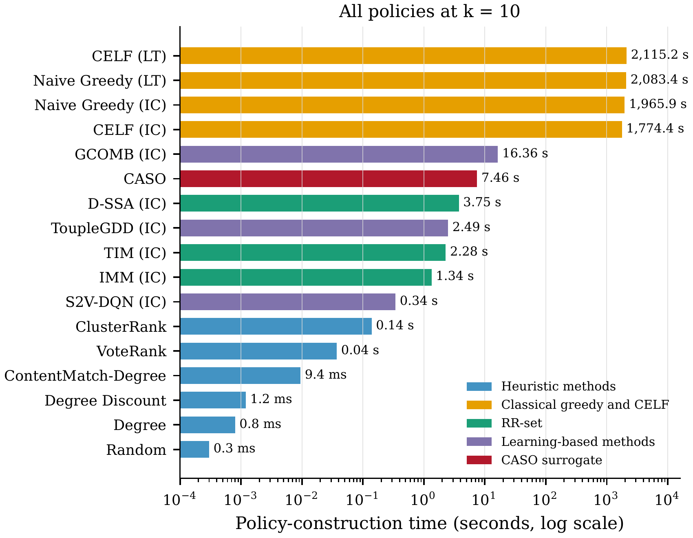

<div align="center">

# MOSAIC

**Multi-Agent Optimization and Simulation for Algorithmically Mediated Influence and Consumption**

Simulate content adoption. Learn from behavioral evidence. Select initial promoters.

[Quick start](#quick-start) · [Workflow](#workflow) · [Results](#results-reported-in-the-paper) · [Release notes](docs/RELEASE.md) · [Citation](#citation-and-license)

</div>

MOSAIC studies **which users to seed to increase consumption of a target item** on a platform where social sharing and algorithmic recommendation interact. It connects **PromoSim** (Promotion Simulation), an LLM-based behavioral simulator, with **CASO** (Content-Aware Surrogate Optimizer), which searches for a set of exactly *k* initial promoters.

The framework accompanies *Generative Agents as Counterfactual Research Infrastructure: Rehearsing Content-Seeding Interventions on Digital Platforms*.



## Overview

- **Behavioral simulation.** PromoSim combines agents with profiles, memory, and bounded actions, a dynamic SimGCL recommender, and social communication over a directed graph.
- **Content-aware prediction.** Frozen BGE-M3 embeddings supply user–movie similarities. CASO combines a local GIN branch with global attention to predict total acceptance.
- **Exact-budget search.** A budget-conditioned flow provides a continuous seed representation. Latent optimization, top-*k* recovery, surrogate-greedy selection, and swap refinement produce a discrete set of *k* users.
- **Controlled evaluation.** Policies are compared through fresh simulation replays with shared initialization within each movie/budget/replication cell and checks for empty histories and recommender interaction state.

**What counts as acceptance?** A nonseed user counts once if they watch the target movie during the 30-round replay. Seed users receive an acceptance label at the initial intervention and broadcast a standardized post. Exposure, mentions, and retransmission alone do not count. The reported outcome includes the seed labels.

### PromoSim architecture



Each replay starts with fresh agents and empty memory, watched/heard histories, and recommender interactions. Agents choose among recommendation, social, and inactive behavior; their actions update the state used in later rounds. Repeated trajectories provide empirical acceptance labels for a movie–seed condition.

For paired policy evaluation, initial interests and recommender parameters are reused across methods in the same cell. State digests check that the preintervention states agree. Remote LLM responses and concurrent execution can still introduce variation.

### CASO architecture



*CASO architecture reproduced from the manuscript: seed-flow training, content-aware acceptance prediction, and exact-budget seed search.*

See the [CASO guide](mosaic/caso/README.md) and [PromoSim guide](mosaic/promosim/README.md) for implementation details and command reference.

## Quick start

The source release includes the implementation and processed inputs for **1,000 users, 3,883 catalog movies, and 20,846 directed ties**. Collected trajectories, fitted checkpoints, content embeddings, and paper experiment drivers are outside this release. You can run the synthetic CPU example immediately after installing the core package.

### Install the core package

The reference environment is **Linux with Python 3.12**. Run these commands from the repository checkout:

```bash
git clone https://github.com/ShouzhiZhao/MOSAIC.git
cd MOSAIC

python3.12 -m venv .venv
source .venv/bin/activate
python -m pip install --upgrade pip
python -m pip install -c constraints-py312.txt -e .
```

For GPU workflows, install a PyTorch build compatible with your CUDA driver before installing the package. The reference GPU stack uses PyTorch 2.9.1 with CUDA 13.0. The [version constraints](constraints-py312.txt) record the main verified dependencies; they are not a complete dependency lockfile.

### Run the CPU example

```bash
mosaic demo --output-dir artifacts/demo
```

This example creates a synthetic 16-user graph, trains a small seed flow and acceptance predictor, saves checkpoints, and predicts acceptance for two example policies. It uses no LLM endpoint or downloaded text encoder. Inspect `artifacts/demo/predictions.csv` and `artifacts/demo/demo.json` when it finishes. Use a new output directory for each run.

The example demonstrates the interfaces with synthetic data and short training runs; its predictions are not research results.

`python -m mosaic` is equivalent to `mosaic`. Every subcommand supports `--help`.

### Choose the dependencies you need

| Task | Installation | Compute |
| --- | --- | --- |
| CPU example, CASO training/prediction, graph baselines | Core package | CPU supported for training/prediction; GPU for larger runs |
| CASO seed search | Core package | CUDA required |
| Static content encoding | `python -m pip install -c constraints-py312.txt -e '.[encoder]'` | CUDA required |
| PromoSim generation and policy evaluation | `python -m pip install -c constraints-py312.txt -e '.[promosim]'` | CUDA and an LLM backend |
| Learned neural baselines | Core package; external weights for S2V-DQN and ToupleGDD | CUDA required |

PromoSim uses an older LangChain/Pydantic stack; keep it in a dedicated virtual environment. See [release notes](docs/RELEASE.md) for environment details and artifact requirements.

## Workflow

The full workflow constructs behavioral evidence once, trains a reusable surrogate, and then evaluates selected policies in fresh replays. Commands below use the bundled graph and input CSVs. Simulation generation makes substantial LLM calls; it is separate from the small CPU example.

### 1. Configure PromoSim and collect trajectories

Install the `promosim` extra and configure your OpenAI-compatible model service:

```bash
export PROMOSIM_API_BASE="https://your-model-endpoint/v1"
export PROMOSIM_API_KEY="your-api-key"
export PROMOSIM_MODEL="your-served-model-name"
```

The model name must exist on your endpoint; the bundled configuration does not provision a serving backend. The custom adapter sends `top_k` and `enable_thinking` in addition to standard sampling parameters, so use a service that supports those fields.

BGE-M3 is downloaded on first use. To use a local encoder snapshot instead, set `MOSAIC_TEXT_ENCODER=/path/to/bge-m3`. Sampling, agent activity, recommendation updates, and the 30-round horizon are configured in [default.yaml](mosaic/promosim/config/default.yaml).

Generate a condition for *Heat* (catalog ID `5`):

```bash
mosaic promosim --target-movie-id 5 \
  --config mosaic/promosim/config/default.yaml \
  --replications 10 --seed 2026
```

Each invocation samples one previously unused seed condition with a budget from 0 through 10, or resumes a matching incomplete condition. Complete trajectories are written under `data/promosim_records/Heat/temp/<condition-id>/`.

Run generation repeatedly to collect multiple conditions for each training movie. Training needs enough conditions for nonempty training and validation sets—at least two per included movie. A single generation command does not construct the paper's training corpus.

To explicitly resume an interrupted condition, rerun the same command with `--resume-condition <condition-id>`. Input hashes and configuration must match. New versioned conditions enter training after all requested replays complete; see [recovery and integrity details](docs/RELEASE.md#replay-integrity-and-recovery).

### 2. Encode content features

Build a static feature catalog covering **every movie used for training or inference**:

```bash
mosaic content-match \
  --movie Heat Jumanji Waiting_to_Exhale GoldenEye id:6 Nixon \
  --output artifacts/caso/content_match.npz
```

The command computes cosine similarity between frozen BGE-M3 embeddings of the static user profiles and movie descriptions. It reads no target acceptance labels, so features can also be generated for movies without behavioral training records.

Movie IDs resolve same-name entries: `id:6` selects the reporting version of *Sabrina*, while `id:903` selects the other entry. Their keys are `Sabrina__id_6` and `Sabrina__id_903`. Unique titles remain accepted. See [movie identity](#data-and-policy-format) before reusing older archives.

### 3. Train CASO

CASO trains in two stages. First, a budget-conditioned flow learns from synthetic random seed masks with budgets 0–10. Second, the flow is frozen and the dual-branch predictor learns total acceptance from PromoSim conditions. Mean/max graph pooling produces a scalar prediction in `[0, number of users]`.

Run both stages from scratch:

```bash
mosaic train \
  --records data/promosim_records \
  --content-match artifacts/caso/content_match.npz \
  --output-dir artifacts/caso/train01
```

The trained checkpoint is `artifacts/caso/train01/best.pt`. The run also saves configuration and split metadata, training history, and validation predictions.

<details>
<summary><strong>Train the flow separately and reuse it</strong></summary>

```bash
mosaic train-flow --updates 40000 --batch-size 256 \
  --output-dir artifacts/caso/flow01

mosaic train \
  --flow-checkpoint artifacts/caso/flow01/flow_pretrained.pt \
  --records data/promosim_records \
  --content-match artifacts/caso/content_match.npz \
  --output-dir artifacts/caso/train02
```

The default flow uses a shared coordinate network, rank coupling, exponential moving averages, a dequantization width of 0.1, and 64-step RK4 integration. Predictor training runs for at most 200 epochs, with early stopping after 40 epochs without improved validation MAE.

</details>

Training splits are defined in [mosaic/config.py](mosaic/config.py). Conditions are split within eligible movies; the configured OOD titles and the new-item *Gamma Rays* target are excluded from both predictor training and validation. Use a new output directory for each training run.

### 4. Search for promoters and predict acceptance

```bash
mosaic optimize \
  --checkpoint artifacts/caso/train01/best.pt \
  --content-match artifacts/caso/content_match.npz \
  --movie Heat GoldenEye --budget 5 10 \
  --output-dir artifacts/caso/search01

mosaic predict \
  --checkpoint artifacts/caso/train01/best.pt \
  --content-match artifacts/caso/content_match.npz \
  --policy-csv artifacts/caso/search01/caso_policies.csv \
  --output artifacts/caso/predictions.csv
```

Search writes `caso_policies.csv`, a detailed `caso_search.csv`, and per-movie JSON records. `predict` scores supplied seed sets using the fitted surrogate. It can also score baseline policies and supports `--device cpu`.

### 5. Evaluate policies with PromoSim

```bash
mosaic evaluate \
  --policy-csv artifacts/caso/search01/caso_policies.csv \
  --replications 10 --seed 2026 \
  --output-dir artifacts/promosim_eval/comparison01
```

`evaluate` runs the simulator and records observed watching-based acceptance. Its main outputs are:

| File | Contents |
| --- | --- |
| `policy_replay_outcomes.csv` | Acceptance, seeds, and RNG seed for each completed replay |
| `policy_replay_summary.csv` | Mean acceptance, standard deviation, and replay count per policy |
| `policy_replay_integrity.jsonl` | Initialization checks, state digests, and run status |
| `initializations/` | Saved interests and recommender initialization for each paired cell |

For a paired comparison of CASO and baselines, combine their policy rows into **one CSV with one header**, then evaluate that file in a single run. Movie, method, and budget combinations must be unique. This lets all methods in a cell reuse the same realized initialization. Existing evaluation directories are preserved; use a new directory for a new comparison.

## Baselines

The implementation covers the paper's 16 main comparators:

| Family | Methods |
| --- | --- |
| Topology | Random, Degree, Degree Discount, VoteRank, ClusterRank |
| Static content | ContentMatch-Degree |
| Classical diffusion | Naive Greedy and CELF under both IC and LT; TIM, IMM, and D-SSA under IC |
| Learned IC policies | S2V-DQN, ToupleGDD, GCOMB |

Generate topology policies on the bundled graph:

```bash
mosaic baselines --algo degree discount voterank clusterrank \
  --movie Heat GoldenEye --k 10 --model IC \
  --results-dir artifacts/baselines/topology01

mosaic content-baseline --movie Heat GoldenEye --k 10 \
  --content-match artifacts/caso/content_match.npz \
  --output artifacts/baselines/content.csv
```

`--k 10` exports the ordered seed sequence's prefixes for budgets 1–10. With `--movie`, graph baselines also produce `baseline_policies_IC.csv`, ready for `predict` or `evaluate`. IC/LT suffixes identify the seed-selection objective; final behavioral comparisons use PromoSim.

The [baseline guide](baselines/README.md) documents algorithm flags, external checkpoints, and fitting requirements. GCOMB includes target-graph fitting; S2V-DQN and ToupleGDD require separately obtained reference weights. GNN-Greedy is also available as a supplementary comparator.

## Results reported in the paper



*Predicted acceptance redrawn from the manuscript table below. Each gray bar represents the strongest baseline for that setting and budget.*

The table below summarizes the manuscript's *Seed-Policy Performance in ID and Zero-Shot OOD Settings* table for the 1,000-user environment. The current archived values are **CASO surrogate predictions**, averaged over three movies. The result provenance records no new policy replays for this comparison, so these values do not provide independent simulator validation of the selected policies. Use `mosaic evaluate` to measure acceptance through fresh PromoSim replays.

| Setting | Seed budget | CASO | Strongest baseline in this cell |
| --- | ---: | ---: | --- |
| In distribution | 5 | **241.8** | 226.4 — ClusterRank |
| In distribution | 10 | **322.0** | 306.6 — S2V-DQN (IC) |
| Zero-shot OOD | 5 | **219.7** | 213.0 — ClusterRank |
| Zero-shot OOD | 10 | **303.2** | 287.6 — GCOMB (IC) |

The ID movies are *Heat*, *Jumanji*, and *Waiting to Exhale*. The zero-shot movies are *GoldenEye*, *Sabrina*, and *Nixon*: their metadata is available, but their behavioral records are excluded from training and checkpoint selection. The graph and user population remain fixed.

At this scale, the paper reports mean CASO search times of **4.00 s** for five seeds and **7.46 s** for ten seeds on an NVIDIA GeForce RTX 5090. These timings cover recurring policy search and exclude corpus construction, model training/loading, graph preparation, and final simulation replay.

<p align="center">
  
</p>

*Policy-construction time at ten seeds, reproduced from the manuscript. Timings include target-graph fitting where applicable; classical methods use the CPU and neural methods use the GPU.*

These are manuscript results, not outputs reproduced by the CPU example or a fresh checkout. The released source supports collecting new evidence and running the core workflow; the original trajectory corpus, fitted checkpoints, and adaptation/ablation experiment drivers are not included. The findings concern the configured simulator and do not establish effects on a live platform.

## Data and policy format

The bundled inputs live in [data/promosim/](data/promosim/). See the [CSV schemas](data/README.md), [provenance notes](data/SOURCES.md), and [input checksums](data/manifest.json).

All policy commands share this interchange format:

```csv
movie,movie_id,method,budget,seeds
Heat,5,Example,3,"[15, 969, 826]"
Heat,5,Control,0,[]
Sabrina__id_6,6,Example,2,"[15, 826]"
```

Seed IDs are zero-based internal user positions. Seeds must be distinct and their count must equal `budget`. Prediction and replay accept the zero-seed control; CASO optimization supports budgets 1–10. Example rows above illustrate the schema and are not optimized policies.

Use catalog IDs for movie identity. Unique titles and older CSVs without `movie_id` remain supported when unambiguous. Title-only features for same-name movies must be regenerated using an explicit ID; renaming a legacy archive cannot establish which description it encoded.

Each replay stores `X` and `sim` with shape `(rounds + 1, users)`. Row zero contains the intervention; later rows contain per-round watching indicators and similarities. The loader checks dimensions, binary outcomes, finite similarities, and consistent seed vectors. CASO uses the separate static content catalog as its content input.

<details>
<summary><strong>Custom data and output locations</strong></summary>

| Variable | Default | Purpose |
| --- | --- | --- |
| `MOSAIC_PROMOSIM_DATA_DIR` | `data/promosim` | Movie, user, and relationship inputs |
| `MOSAIC_SIMULATION_DATA_DIR` | `data/promosim_records` | Generated replay conditions |
| `MOSAIC_ARTIFACTS_DIR` | `artifacts` | Default model and result locations |
| `MOSAIC_TEXT_ENCODER` | `BAAI/bge-m3` | Encoder model identifier or local snapshot |

Set these before starting a command. Explicit path arguments such as `--records`, `--relationship`, and `--content-match` select individual inputs. Model dimensions, feature vectors, and seed IDs must refer to the same user ordering and graph. When using an installed wheel outside the checkout, point `MOSAIC_PROMOSIM_DATA_DIR` to your input CSVs.

</details>

## Repository map

```text
mosaic/
├── cli.py                # Public command dispatcher
├── catalog.py            # Movie identity and disambiguation
├── policies.py           # Shared seed-policy CSV interface
├── demo.py               # Synthetic CPU example
├── caso/                 # Content features, flow, predictor, training, search
└── promosim/             # Agents, memory, recommender, generation, replay
baselines/                # Topology, diffusion, and learned comparators
data/promosim/            # Three bundled input CSVs
assets/                   # README figures based on the manuscript
docs/                     # Release notes and environment details
```

CI checks lint, compilation, packaging, and the installed CPU example. Release boundaries, dependency details, archive migration, and recovery behavior are documented in [release notes](docs/RELEASE.md).

| Guide | What it covers |
| --- | --- |
| [CASO](mosaic/caso/README.md) | Feature preparation, two-stage training, seed search, and acceptance prediction |
| [PromoSim](mosaic/promosim/README.md) | LLM setup, generation, recovery, and paired policy evaluation |
| [Baselines](baselines/README.md) | Algorithm selection, graph assumptions, checkpoints, and policy exports |
| [Data](data/README.md) | CSV schemas, movie/user identity, replay archives, and content catalogs |

## Contributor

[ShouzhiZhao](https://github.com/ShouzhiZhao), the owner of this repository.

## Citation and license

Use [CITATION.cff](CITATION.cff) for the software citation. The associated manuscript is titled *Generative Agents as Counterfactual Research Infrastructure: Rehearsing Content-Seeding Interventions on Digital Platforms*.

MOSAIC-specific software is released under the [MIT License](LICENSE). PromoSim derives from RecAgent/YuLan-Rec; neural baseline ports retain their upstream notices. See [NOTICE.md](NOTICE.md) for attribution. Input data and external model weights retain their own terms; the software license does not assign a new license to them.
